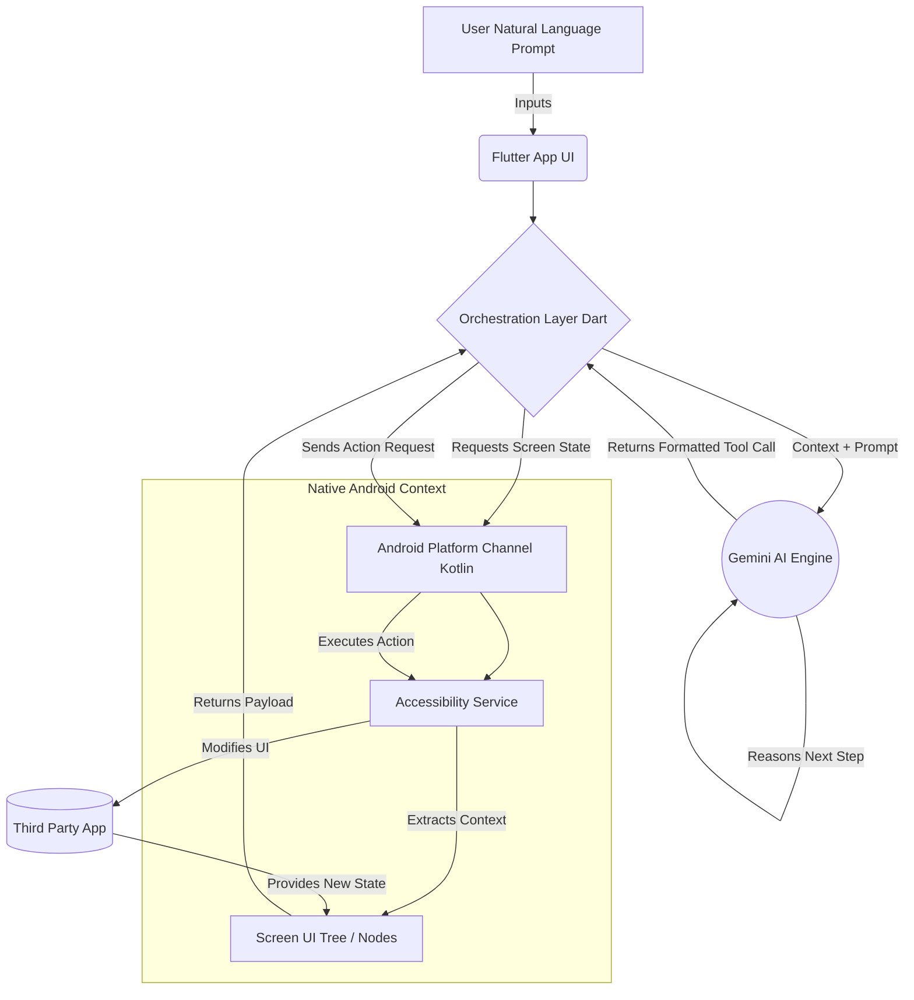

<a name="readme-top"></a>

<div align="center">
  <!-- Replace this with your actual app logo, or just keep the emoji title! -->
  <br />

  <h1 align="center">🤖 PocketPilot</h1>

  <p align="center">
    <strong>Your Open-Source AI Copilot for Android Automation</strong>
    <br />
    <a href="https://github.com/sumanthnani10/PocketPilot/issues">Report Bug</a>
    ·
    <a href="https://github.com/sumanthnani10/PocketPilot/issues">Request Feature</a>
  </p>

  <!-- Badges -->
  <p>
    <a href="https://flutter.dev"></a>
    <a href="https://kotlinlang.org"></a>
    <a href="https://ai.google.dev/"></a>
    <a href="https://github.com/sumanthnani10/PocketPilot/blob/main/LICENSE"></a>
    <a href="https://github.com/sumanthnani10/PocketPilot/graphs/contributors"></a>
    <a href="https://github.com/sumanthnani10/PocketPilot/stargazers"></a>
  </p>
</div>

<!-- TABLE OF CONTENTS -->
<details open>
  <summary><b>Table of Contents</b></summary>
  <ol>
    <li>
      <a href="#-about-the-project">About The Project</a>
      <ul>
        <li><a href="#-core-features">Core Features</a></li>
        <li><a href="#️-built-with">Built With</a></li>
      </ul>
    </li>
    <li><a href="#-how-it-works">How It Works</a></li>
    <li><a href="#-architecture">Architecture</a></li>
    <li>
      <a href="#-getting-started">Getting Started</a>
      <ul>
        <li><a href="#prerequisites">Prerequisites</a></li>
        <li><a href="#installation">Installation</a></li>
      </ul>
    </li>
    <li><a href="#-roadmap">Roadmap</a></li>
    <li><a href="#-contributing">Contributing</a></li>
    <li><a href="#-license">License</a></li>
    <li><a href="#-contact">Contact</a></li>
  </ol>
</details>

---

## 📖 About The Project

### 🎥 Watch it in Action

**Simple Task Execution:**  
[▶️ Watch Simple Task Execution Video](sample.webm)

**Complex Agentic Workflow:**  
[▶️ Watch Complex Agentic Workflow Video](sample2.webm)

> **Note:** Many local IDE Markdown previewers disable embedded video tags for security. Clicking the links above will open the videos in your default media player. When you push this to GitHub, the repository will recognize and natively play these files.

[![PocketPilot Product Screenshot][product-screenshot]](https://github.com/sumanthnani10/PocketPilot)

**PocketPilot** is a revolutionary, open-source **Android automation** framework that bridges the gap between **Large Language Models (LLMs)** and **on-device actions**. Think of it as a conversational **mobile RPA** (Robotic Process Automation) tool native to your smartphone. If you are looking for **agentic AI in mobile** or **Android RPA** solutions, PocketPilot provides an intelligent and adaptable approach.

Instead of dealing with rigid visual scripting or brittle X/Y coordinates that break upon UI updates, PocketPilot relies on strict **cognitive automation** and **mobile AI automation**. You talk naturally, and the agent dynamically understands the app's structure, adapts to UI changes on the fly, and figures out how to execute your intent autonomously.

### 🌟 Core Features

* **🗣️ Natural Language Control:** Issue commands like *"Post my latest photo on Instagram"* or *"Turn on the living room AC"* and let the AI plan the exact steps to accomplish it.
* **🤝 Accessibility & Assistive Tech:** By enabling full voice-to-action control and bypassing complex visual navigation, PocketPilot acts as a powerful assistive tool, empowering users with motor or visual impairments to interact with any app effortlessly.
* **👁️ Context-Aware Perception:** Utilizes deep Android `AccessibilityService` APIs to read and map out a comprehensive, node-based DOM of the current screen.
* **🧠 Cognitive AI Planning:** Powered by Google's **Gemini API**, which represents the "brain" navigating unknown or complex screen layouts to safely fulfill tasks.
* **⚡ Native Execution Engine:** Seamlessly executes node-based actions (taps, scrolls, text-entry) natively, drastically improving reliability over traditional coordinate-based macro tools.
* **🔄 Teach & Replay *(Phase 2)*:** Train the agent on a specific complex workflow once, and allow the cognitive engine to replay and parameterize those interaction sequences as standalone skills later.

### 🛠️ Built With

We leverage a hybrid approach, combining the rapid cross-platform UI development of Flutter with the deep OS integrations of native Android.

* [![Flutter][Flutter.dev]][Flutter-url]
* [![Kotlin][Kotlin.org]][Kotlin-url]
* [![Gemini][Gemini.com]][Gemini-url]
* [![Android][Android.com]][Android-url]

<p align="right">(<a href="#readme-top">back to top</a>)</p>

---

## 💡 How It Works

PocketPilot is driven by an autonomous **Observe → Plan → Act** cognitive loop. It acts intelligently, rather than following a blinded script.

1. **Observe**: Upon receiving a task, PocketPilot uses its native Android `AccessibilityService` to quickly dump a full, structured UI tree of the current application.
2. **Plan**: This detailed screen state, alongside the user's overarching goal, is streamed securely to the Gemini reasoning engine. Gemini evaluates the layout, selects the target element, and decides the next action (e.g., `tap_node`, `type_text`, `scroll_down`).
3. **Act**: The Kotlin native core catches this semantic tool call from Dart, finds the corresponding screen node, and physically performs the gesture securely.
4. **Loop**: PocketPilot captures the new screen state and repeats the cycle until the goal is declared complete or human intervention is required.

<p align="right">(<a href="#readme-top">back to top</a>)</p>

---

## 🏗 Architecture

PocketPilot is built on a decoupled architecture, allowing fluid UI updates and AI reasoning without blocking native OS tasks.



<p align="right">(<a href="#readme-top">back to top</a>)</p>

---

## 🚀 Getting Started

To get a local copy up and running, follow these simple steps.

### Prerequisites

* **Android Device / Emulator:** OS-level accessibility features are strictly required to scrape UI nodes and perform touches. *(iOS is currently not supported due to OS sandbox constraints)*.
* **Flutter SDK:** Ensure you have the latest stable version of Flutter.
* **Gemini API Key:** Grab a free API key from [Google AI Studio](https://aistudio.google.com/app/apikey).

### Installation

1. **Clone the repository**
   ```bash
   git clone https://github.com/sumanthnani10/PocketPilot.git
   ```
2. **Open the project** in Android Studio or VS Code.
3. **Install Dart packages**
   ```bash
   cd PocketPilot
   flutter pub get
   ```
4. **Run the application**
   ```bash
   flutter run
   ```
5. **Grant Accessibility Permissions (CRITICAL)**: 
   The very first time you launch PocketPilot on a device, navigate to your Android settings:
   `Settings > Accessibility > Installed Apps`
   Enable the `PocketPilot` Accessibility Service. The app *will not work* without this explicit permission.
6. **Configure the AI Engine**: 
   Launch PocketPilot, navigate to the Settings page, and securely enter your **Gemini API Key**.

<p align="right">(<a href="#readme-top">back to top</a>)</p>

---

## 🛣 Roadmap

- [x] Phase 1a: Flutter UI structure & platform channels setup
- [x] Phase 1b: Core Android Accessibility Service extraction (Screen parsing)
- [ ] Phase 1c: Gemini tool-calling integrations and conversational loop
- [ ] Phase 1d: Error handling, loop breaking, and user-intervention boundaries
- [ ] Phase 2a: Action recording system (Teach Mode)
- [ ] Phase 2b: Skill library UI and local persistence
- [ ] Phase 2c: Intelligent skill parameterized replay

See the [open issues](https://github.com/sumanthnani10/PocketPilot/issues) for a full list of proposed features (and known issues).

<p align="right">(<a href="#readme-top">back to top</a>)</p>

---

## 🤝 Contributing

Contributions are what make the open source community such an amazing place to learn, inspire, and create. Any contributions you make are **greatly appreciated**.

If you have a suggestion that would make this better, please fork the repo and create a pull request. You can also simply open an issue with the tag `enhancement`.
Don't forget to give the project a ⭐! Thanks again!

1. Fork the Project
2. Create your Feature Branch (`git checkout -b feature/AmazingFeature`)
3. Commit your Changes (`git commit -m 'Add some AmazingFeature'`)
4. Push to the Branch (`git push origin feature/AmazingFeature`)
5. Open a Pull Request

<p align="right">(<a href="#readme-top">back to top</a>)</p>

---

## � License

Distributed under the **PolyForm Noncommercial License 1.0.0**. See `LICENSE` for more information and commercial terms.

<p align="right">(<a href="#readme-top">back to top</a>)</p>

---

## 📬 Contact

<p>
  <b>Sumanth</b> - 
  <a href="https://github.com/sumanthnani10">@sumanthnani10</a>
</p>
<p>
  Project Link: <a href="https://github.com/sumanthnani10/PocketPilot">https://github.com/sumanthnani10/PocketPilot</a>
</p>

<p align="right">(<a href="#readme-top">back to top</a>)</p>

---

<!-- MARKDOWN LINKS & IMAGES -->
<!-- Replace the link below with the relative or absolute link to your screenshot. Examples: `assets/screenshot.png` or `https://example.com/screenshot.png` -->
[product-screenshot]: flutter_01.png
[Flutter.dev]: https://img.shields.io/badge/Flutter-02569B?style=for-the-badge&logo=flutter&logoColor=white
[Flutter-url]: https://flutter.dev/
[Kotlin.org]: https://img.shields.io/badge/Kotlin-0095D5?style=for-the-badge&logo=kotlin&logoColor=white
[Kotlin-url]: https://kotlinlang.org/
[Gemini.com]: https://img.shields.io/badge/Google%20Gemini-8E75B2?style=for-the-badge&logo=google%20gemini&logoColor=white
[Gemini-url]: https://ai.google.dev/
[Android.com]: https://img.shields.io/badge/Android-3DDC84?style=for-the-badge&logo=android&logoColor=white
[Android-url]: https://developer.android.com/
